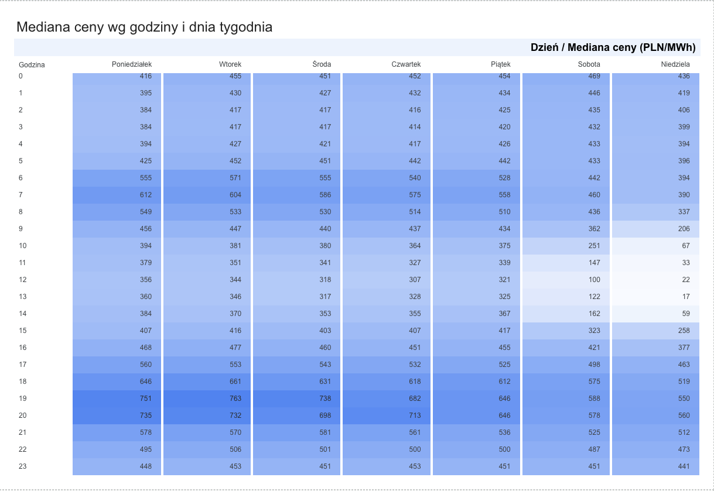
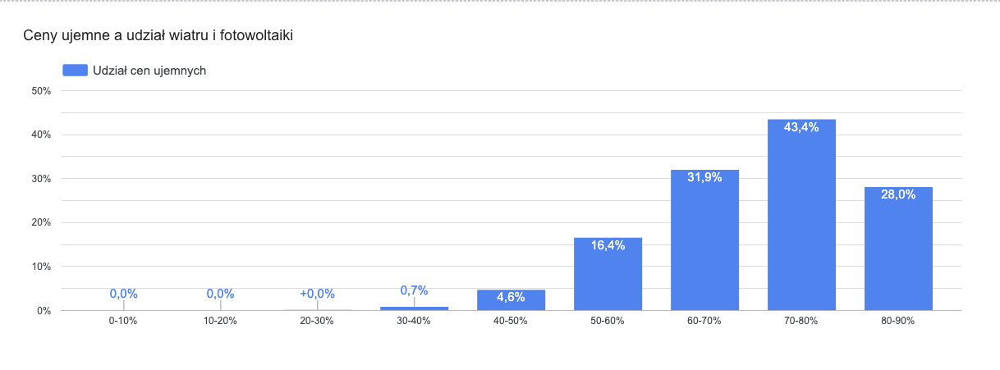

# Ceny energii w Polsce - przesunięcie 20% zużycia w dobie obniża koszt o 21,6%

**[▶ Otwórz dashboard](https://lookerstudio.google.com/reporting/3423ae87-ed0b-49ac-89fb-7a45a6840c7b)** - Looker Studio, 3 strony: przegląd · wzorce dobowe · OZE a cena

Odbiorca rozliczany według ceny rynkowej, który przenosi **20% dobowego zużycia**
z najdroższych do najtańszych kwadransów **tej samej doby**, obniża koszt energii
o **98,70 PLN/MWh, czyli o 21,6%** - bez żadnej inwestycji, wyłącznie zmieniając
harmonogram. Ceny są publikowane dzień wcześniej, więc rekomendacja nie wymaga
prognozowania.

Podstawa: **76 512 kwadransów 15-minutowych** z API Polskich Sieci Elektroenergetycznych,
797 dób z okresu 14.06.2024 - 19.08.2026, połączonych z generacją wiatru i fotowoltaiki
oraz zapotrzebowaniem krajowego systemu.

> **RCE to rynkowa cena rozliczeniowa, a nie cena z faktury odbiorcy.** Rachunek zawiera
> dodatkowo dystrybucję, opłatę mocową i akcyzę, a te w większości nie zależą od godziny
> poboru. Analiza opisuje wzorce cenowe na rynku i dotyczy wyłącznie składnika energii.

---

## Problem biznesowy

Zakład produkcyjny albo obiekt komercyjny rozliczany według ceny indeksowanej do rynku
płaci za energię inną stawkę w każdym kwadransie doby. Część zużycia da się przesunąć
w czasie - chłodnie, pompy ciepła, ładowanie flot, wybrane procesy produkcyjne - ale
przebudowa harmonogramu kosztuje i wymaga uzasadnienia liczbą.

**Pytanie decyzyjne:** ile realnie warto przesunąć i czy gra jest warta świeczki?

Analiza odpowiada trzema krokami: kiedy energia jest tania, dlaczego akurat wtedy,
i ile daje przesunięcie o zadaną skalę.

---

## Kluczowe wnioski

**1. Najtańsze godziny doby to nie noc, tylko środek dnia.**
Mediana ceny o 19:00 jest o **120% wyższa** niż o 12:00 (659 wobec 300 PLN/MWh).
Ta sama para godzin liczona średnią daje **+184%** (736 wobec 259) - wybór miary
zmienia wielkość efektu o 64 punkty procentowe. *Do opisywania wzorców używam mediany,
do liczenia pieniędzy średniej, bo koszt to suma iloczynów ceny i zużycia.*

**2. W niedzielne południe cena praktycznie znika.**
Mediana o 12:00 wynosi **22 PLN/MWh w niedzielę i 356 w poniedziałek** - ta sama produkcja
ze słońca, inne zapotrzebowanie przemysłu. Odbiorca z elastycznością weekendową ma
najtańszą energię w roku w tym jednym oknie.



*Mediana ceny w 168 komórkach godzina × dzień tygodnia. Prawy dolny obszar - weekendowe
południe - to najtańsza energia w tygodniu; najdroższa jest w dni robocze o 19:00.
Dolina cenowa wypada w środku dnia, nie w nocy.*

**3. Ceny ujemne mają wyraźny próg: 30% udziału OZE.**
Poniżej tego progu praktycznie nie występują - **6 kwadransów na 47 969**. Powyżej 70%
udziału dotyczą **42,4% kwadransów**, czyli niemal co drugiego.



*Trzy pierwsze koszyki są zerowe - poniżej 30% udziału OZE ceny ujemne po prostu się nie
zdarzają. Spadek w koszyku 80-90% jest realny, ale opiera się na 75 kwadransach z 76 512.*

**4. Zależność OZE-cena przeżywa kontrolę na porę dnia - i wzmacnia się.**
Udział OZE jest silnie związany z porą dnia (korelacja profili godzinowych **−0,725**),
więc proste zestawienie ceny z udziałem pokazywałoby po części profil dobowy. Po ograniczeniu
porównania do stałej pory dnia efekt nie znika:

| Zakres | Spadek mediany z koszyka 0-10% do 50-60% |
|---|---|
| cała doba (naiwny) | −62,8% |
| godziny 11-14 | −75,6% |
| godziny 0-4 - sam wiatr, PV nie pracuje | **−90,8%** |

*Pora dnia tego efektu nie zawyżała, tylko go maskowała: w wersji naiwnej koszyk 0-10%
mieszał tanią noc z drogim wieczorem.*

**5. Hipoteza „dolina cenowa pogłębia się rok do roku" - odrzucona.**
Pierwszy wykres sugerował pogłębianie, ale zakres danych nie pokrywał się między latami,
a dolina jest zjawiskiem letnim. Po zrównaniu okien kalendarzowych (231 dni na rok)
dolina stoi w miejscu: **193 → 188 PLN/MWh**, w granicach szumu. Rośnie natomiast
**szczyt wieczorny** (658 → 695) i **amplituda doby** (465 → 508) - a to właśnie od amplitudy
zależy opłacalność przesunięcia.

---

## Rekomendacja

| Przesunięcie zużycia | Spread w dobie | Oszczędność | Udział w koszcie |
|---|---|---|---|
| 10% | 587,98 | 58,80 PLN/MWh | 12,9% |
| **20%** | **493,51** | **98,70 PLN/MWh** | **21,6%** |
| 30% | 405,88 | 121,76 PLN/MWh | 26,6% |

Zależność jest **wklęsła**: pierwsze przesunięte procenty są najcenniejsze, bo przy większych
koszykach do porównania wchodzą kwadranse przeciętne. Praktycznie oznacza to, że nie trzeba
przebudowywać całego profilu zużycia, żeby zobaczyć efekt.

Rok do roku, na wspólnym oknie 231 dni: oszczędność rośnie w złotówkach
(93,17 → 112,37 PLN/MWh), ale niemal nie rośnie procentowo (21,96% → 23,28%), bo równolegle
podniósł się ogólny poziom cen. **Rośnie kwota oszczędności, nie jej udział w rachunku.**

---

## Dane

| | |
|---|---|
| Źródło | [API PSE](https://api.raporty.pse.pl/) - bez klucza, publiczne |
| Zasoby | `rce-pln` (cena rozliczeniowa), `his-wlk-cal` (generacja PV i wiatru, zapotrzebowanie KSE) |
| Rozdzielczość | 15 minut, 96 rekordów na dobę |
| Zakres | 14.06.2024 - 19.08.2026 (najstarszy dostępny rekord to 14.06.2024) |
| Wielkość | 76 512 kwadransów, 797 dób, **zero braków** po złączeniu |
| Zakres cen | −1 457,59 do +2 751,72 PLN/MWh, średnia 457,71, mediana 451,35 |

**Pułapki wychwycone w danych:**

- **Paginacja.** Odpowiedź API zawiera `nextLink`; jego pominięcie daje niepełne dane bez
  żadnego błędu. Kontrola liczby rekordów na dobę wyłapuje to od razu.
- **`dtime` oznacza koniec kwadransa, nie początek.** Godzina liczona z `dtime` przesunęłaby
  profil dobowy o 15 minut na 25% wierszy - bez komunikatu. Godzina jest brana z pola `period`.
- **Doby zmiany czasu mają 92 i 100 kwadransów**, nie 96. Koszyki w modelu są więc definiowane
  przez pozycję znormalizowaną, a nie stałą liczbę kwadransów - inaczej „20%" znaczyłoby
  raz 24%, raz 25% zużycia.
- **Niekompletne doby.** PSE publikuje ceny z wyprzedzeniem, a generację z opóźnieniem, więc
  bieżąca doba zawsze przychodzi niepełna. Próg odrzucenia jest wyliczany z danych,
  nie wpisany na sztywno.
- **Ceny ujemne nie są błędem danych** i nie są filtrowane. Jest ich 3 205, czyli 4,19%.

---

## Metoda

1. **Pobranie** dwóch zasobów PSE zapytaniami miesięcznymi z obsługą paginacji i kontrolą
   kompletności (`scripts/import_data.py`)
2. **Złączenie** cen z generacją po dobie i kwadransie, z walidacją `one_to_one` i raportem
   wierszy bez pary (`scripts/prepare_data.py`)
3. **Kolumny pochodne:** godzina z początku przedziału, dzień tygodnia, miesiąc, flaga weekendu,
   udział OZE = (pv + wi) / demand
4. **Profil dobowy** liczony medianą i średnią równolegle, z kontrolą skośności przez różnicę
   obu miar w każdej godzinie
5. **Kontrola sezonowa** hipotezy o pogłębianiu doliny na dwóch niezależnych oknach
   kalendarzowych (67 dni × 3 lata oraz 231 dni × 2 lata)
6. **Kontrola zmiennej zakłócającej** przy zależności OZE-cena: porównanie wewnątrz stałej
   pory dnia, w tym test nocny izolujący sam wiatr (mediana PV w godzinach 0-4 wynosi 0 MW)
7. **Model przesunięcia zużycia** liczony osobno dla każdej doby, potem uśredniany po dobach -
   percentyle globalne wskazywałyby czerwcowe południa zamiast najtańszych godzin danego dnia
8. **Eksport agregatów** do pięciu małych CSV zasilających dashboard, z trzema kontrolami
   przerywającymi eksport przy rozjeździe z notebookami (`scripts/export_aggregates.py`)

---

## Stack

**Python** (pandas, matplotlib) · **Jupyter** · **Looker Studio** (tabela przestawna z mapą
termiczną, pola obliczeniowe) · **Google Sheets** jako warstwa pośrednia · **API REST** z paginacją

---

## Struktura repozytorium

```
energia-pl/
├── scripts/
│   ├── import_data.py          # pobieranie z API PSE, paginacja, kontrola kompletności
│   ├── prepare_data.py         # złączenie źródeł, korekta czasu, kolumny pochodne
│   └── export_aggregates.py    # 5 agregatów pod dashboard + kontrole spójności
├── notebooks/
│   ├── 01_wzorce_cenowe.ipynb  # profil dobowy, kontrola sezonowa, odrzucona hipoteza
│   ├── 02_oze_a_cena.ipynb     # udział OZE a cena, kontrola na porę dnia, ceny ujemne
│   └── 03_rekomendacja.ipynb   # model przesunięcia zużycia, oszczędność, kontrola rok do roku
├── data/
│   ├── raw/                    # surowe odpowiedzi API (poza repozytorium)
│   └── processed/              # energia_pl.csv - zbiór analityczny (poza repozytorium)
└── reports/
    ├── agg/                    # agregaty zasilające dashboard (1014 wierszy, 92 KB)
    └── png/                    # wykresy do dokumentacji
```

---

## Jak odtworzyć

```bash
git clone https://github.com/wp-pakulski/energia-pl.git
cd energia-pl
pip install -r requirements.txt

python scripts/import_data.py       # ~5 min, pobiera 26 miesięcy z API PSE
python scripts/prepare_data.py      # złączenie i czyszczenie
python scripts/export_aggregates.py # agregaty do reports/agg/
```

Potem notebooki `01` → `02` → `03` w dowolnym środowisku Jupyter.

Dane surowe i przetworzone są poza repozytorium - odtwarza je pierwszy krok. Zakres dat
jest ustawiony na końcu `import_data.py`.

---

## Ograniczenia

- **RCE to nie faktura.** Oszczędność dotyczy wyłącznie składnika energii; w całym rachunku
  będzie procentowo mniejsza, bo dystrybucja, opłata mocowa i akcyza nie zależą od godziny poboru.
- **Model zakłada pełną elastyczność** przesuwanej części zużycia - przeniesienie w dowolny
  kwadrans doby bez kosztu i bez strat. Realny odbiorca ma ograniczenia technologiczne,
  a najtańsze kwadranse bywają rozrzucone po dobie zamiast tworzyć jeden ciągły blok.
- **Dwa lata to za mało na tezę o trendzie.** Porównanie rok do roku obejmuje dwa porównywalne
  okna - to jedna obserwacja zgodna z przewidywaniem, a nie jego dowód.
- **Zależność OZE-cena jest wyjaśniająca, nie prognostyczna.** Zasób `his-wlk-cal` jest
  publikowany ex post, więc nie da się na nim zbudować prognozy ceny.
- **Wzrostu poziomu cen w 2026** (około 40% poza południem) zbiór nie wyjaśnia - nie zawiera
  kosztów paliw ani uprawnień do emisji CO₂.
